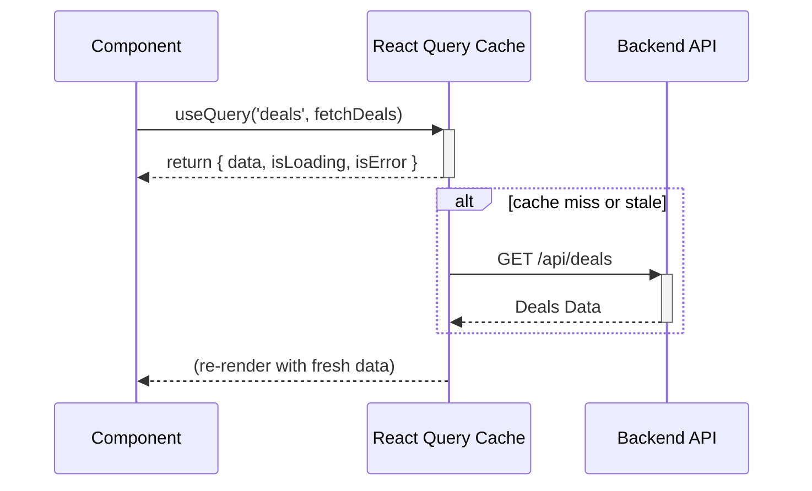

# Data Flow Diagram

This document describes the data flow within the DealWise frontend application.

## Overview

We use **TanStack React Query** as the primary mechanism for managing server state. This centralizes our data fetching, caching, and synchronization logic.

